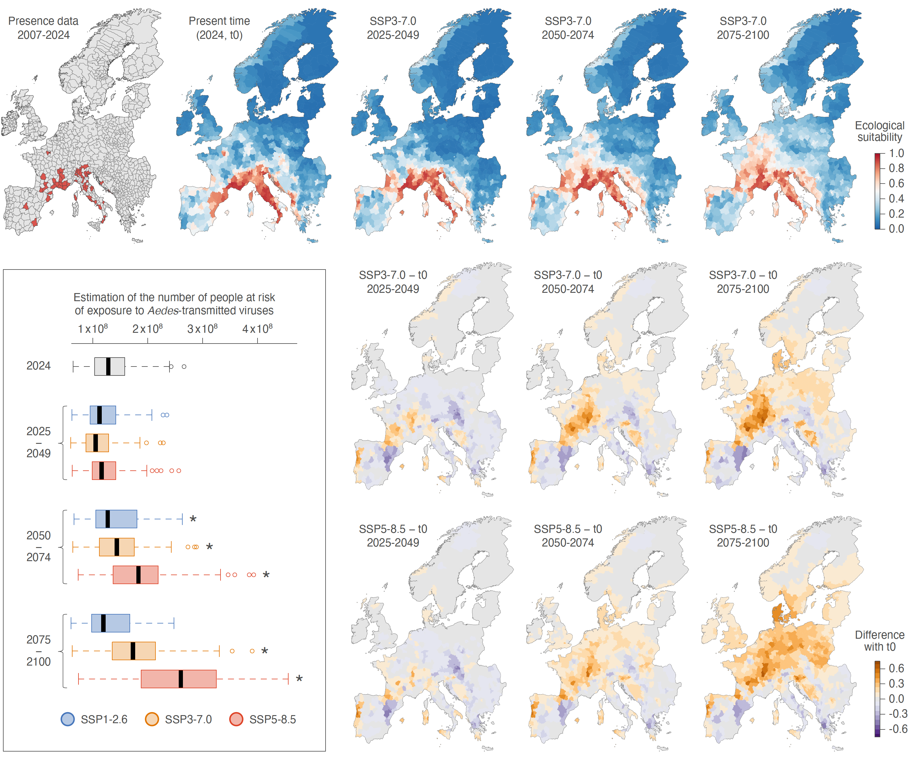

<h1> Evolution of the local risk of <i>Aedes</i>-borne viral circulation in Europe </h1>

This repo gathers the input files and scripts related to our study entitled "**Escalating human exposure to tropical mosquito-borne viruses in Europe**" (*submitted*.). R scripts used to conduct the ecological niche modelling analyses described in this study are all available in `Script_ATV_ENM_Europe.r`.

Abstract: Human-induced climate change has multiple public health impacts, including the expansion of the geographical range of vector-borne diseases. Pathogens such as dengue, chikungunya and Zika viruses, transmitted by Aedes mosquitos, can cause severe health outcomes ranging from acute febrile illness, chronic joint pain, to birth defects and even death. Evaluating the future risk of human population exposure is therefore crucial as large outbreaks could overwhelm healthcare systems. Europe, one of the fastest warming regions globally, harbours the competent mosquito vector Aedes albopictus in over 20 countries, making tropical Aedes-borne viruses an increasing threat to the continent, which has already experienced local outbreaks over the past two decades. Here we use an ecological niche modelling approach to assess past, present, and future risk of human population exposure to dengue, chikungunya, and Zika viruses in Europe. Our results show that recent climate change has already increased the potential exposure to these viruses, particularly across the Mediterranean basin, which is a current hotspot for local outbreaks. Major metropolitan areas in Spain, France, Italy, and Croatia are by now located in at-risk areas, and this risk is projected to intensify and expand northward by mid-century. Under a high greenhouse gas emissions scenario, European areas ecologically suitable for Aedes-borne virus circulation could increase by up to ~70%, leading to an additional ~50 million people living in areas at risk by the end of the century. These findings underscore the urgent need for strengthened vector and epidemiological surveillance, as well as preparedness strategies across newly suitable regions to anticipate future public health threats associated with these arboviral diseases.

**Future projections of the European areas ecologically suitable for the local circulation of Aedes-borne viruses and for the associated human population at risk of exposure under three different shared socio-economic pathways (SSPs).** The first row of maps displays the spatial distribution of the presence data (administrative areas with confirmed local infection cases) from 2007 to 2024 used to train the ecological niche models, the predicted ecological suitability for the local circulation of those viruses at the present time (2024, also referred to as “t0”), and the future projections for three successive periods (2025-2049, 2050-2074, 2075-2100) under the high emissions scenario SSP3-7.0 (see Figure S4 for the projections under the low and very high emissions scenarios, SSP1-2.6 and SSP5-8.5). The second and third rows of maps display the difference in ecological suitability between estimates obtained for specific future projections for scenarios SSP3-7.0 or SSP5-8.5 and estimates obtained for the present-day (“t0”). Finally, the embedded boxplot graphic reports the number of people estimated to live in European areas at risk of exposure to local Aedes-borne virus circulation for the different periods and SSPs considered (see the Methods section for further detail on the approach used to define the areas at risk). (*) refers to a significant increase in the estimated number of people living in at-risk areas as compared to 2024 (as evaluated with a paired Wilcoxon test).
